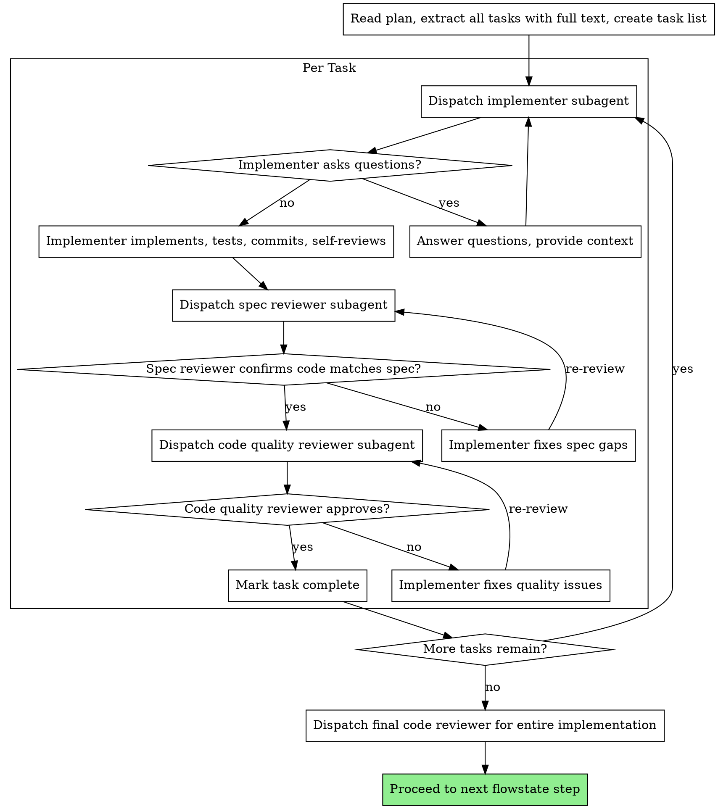

# Subagent-Driven Development

Execute plan by dispatching fresh subagent per task, with two-stage review after each: spec compliance review first, then code quality review.

**Core principle:** Fresh subagent per task + two-stage review (spec then quality) = high quality, fast iteration

## When to Use

- You have an implementation plan (from `flowstate-writing-plans`)
- Tasks are mostly independent
- You want to stay in the current session (not dispatch to a parallel session)

## The Process



---

## Implementer Prompt Template

Use this template when dispatching an implementer subagent.

```
Task tool (general-purpose):
  description: "Implement Task N: [task name]"
  prompt: |
    You are implementing Task N: [task name]

    ## Task Description

    [FULL TEXT of task from plan - paste it here, don't make subagent read file]

    ## Context

    [Scene-setting: where this fits, dependencies, architectural context]

    ## Before You Begin

    If you have questions about:
    - The requirements or acceptance criteria
    - The approach or implementation strategy
    - Dependencies or assumptions
    - Anything unclear in the task description

    **Ask them now.** Raise any concerns before starting work.

    ## Your Job

    Once you're clear on requirements:
    1. Implement exactly what the task specifies
    2. Write tests (following TDD if task says to)
    3. Verify implementation works
    4. Commit your work
    5. Self-review (see below)
    6. Report back

    Work from: [directory]

    **While you work:** If you encounter something unexpected or unclear, **ask questions**.
    It's always OK to pause and clarify. Don't guess or make assumptions.

    ## Before Reporting Back: Self-Review

    Review your work with fresh eyes. Ask yourself:

    **Completeness:**
    - Did I fully implement everything in the spec?
    - Did I miss any requirements?
    - Are there edge cases I didn't handle?

    **Quality:**
    - Is this my best work?
    - Are names clear and accurate (match what things do, not how they work)?
    - Is the code clean and maintainable?

    **Discipline:**
    - Did I avoid overbuilding (YAGNI)?
    - Did I only build what was requested?
    - Did I follow existing patterns in the codebase?

    **Testing:**
    - Do tests actually verify behavior (not just mock behavior)?
    - Did I follow TDD if required?
    - Are tests comprehensive?

    If you find issues during self-review, fix them now before reporting.

    ## Report Format

    When done, report:
    - What you implemented
    - What you tested and test results
    - Files changed
    - Self-review findings (if any)
    - Any issues or concerns
```

---

## Spec Compliance Reviewer Prompt Template

Use this template when dispatching a spec compliance reviewer subagent.

**Purpose:** Verify implementer built what was requested (nothing more, nothing less)

```
Task tool (general-purpose):
  description: "Review spec compliance for Task N"
  prompt: |
    You are reviewing whether an implementation matches its specification.

    ## What Was Requested

    [FULL TEXT of task requirements]

    ## What Implementer Claims They Built

    [From implementer's report]

    ## CRITICAL: Do Not Trust the Report

    The implementer finished suspiciously quickly. Their report may be incomplete,
    inaccurate, or optimistic. You MUST verify everything independently.

    **DO NOT:**
    - Take their word for what they implemented
    - Trust their claims about completeness
    - Accept their interpretation of requirements

    **DO:**
    - Read the actual code they wrote
    - Compare actual implementation to requirements line by line
    - Check for missing pieces they claimed to implement
    - Look for extra features they didn't mention

    ## Your Job

    Read the implementation code and verify:

    **Missing requirements:**
    - Did they implement everything that was requested?
    - Are there requirements they skipped or missed?
    - Did they claim something works but didn't actually implement it?

    **Extra/unneeded work:**
    - Did they build things that weren't requested?
    - Did they over-engineer or add unnecessary features?
    - Did they add "nice to haves" that weren't in spec?

    **Misunderstandings:**
    - Did they interpret requirements differently than intended?
    - Did they solve the wrong problem?
    - Did they implement the right feature but wrong way?

    **Verify by reading code, not by trusting report.**

    Report:
    - Spec compliant (if everything matches after code inspection)
    - Issues found: [list specifically what's missing or extra, with file:line references]
```

---

## Code Quality Reviewer Prompt Template

Use this template when dispatching a code quality reviewer subagent.

**Purpose:** Verify implementation is well-built (clean, tested, maintainable)

**Only dispatch after spec compliance review passes.**

Use the `flowstate-code-review` skill to dispatch a code-reviewer subagent with:

- `WHAT_WAS_IMPLEMENTED`: from implementer's report
- `PLAN_OR_REQUIREMENTS`: Task N from the plan file
- `BASE_SHA`: commit before task
- `HEAD_SHA`: current commit
- `DESCRIPTION`: task summary

**Code reviewer returns:** Strengths, Issues (Critical/Important/Minor), Assessment

---

## Example Workflow

```
You: I'm using flowstate-subagent-development to execute this plan.

[Read plan file once: docs/plans/feature-plan.md]
[Extract all 5 tasks with full text and context]
[Create task list with all tasks]

Task 1: Hook installation script

[Get Task 1 text and context (already extracted)]
[Dispatch implementation subagent with full task text + context]

Implementer: "Before I begin - should the hook be installed at user or system level?"

You: "User level (~/.config/hooks/)"

Implementer: "Got it. Implementing now..."
[Later] Implementer:
  - Implemented install-hook command
  - Added tests, 5/5 passing
  - Self-review: Found I missed --force flag, added it
  - Committed

[Dispatch spec compliance reviewer]
Spec reviewer: Spec compliant - all requirements met, nothing extra

[Get git SHAs, dispatch code quality reviewer]
Code reviewer: Strengths: Good test coverage, clean. Issues: None. Approved.

[Mark Task 1 complete]

Task 2: Recovery modes

[Get Task 2 text and context (already extracted)]
[Dispatch implementation subagent with full task text + context]

Implementer: [No questions, proceeds]
Implementer:
  - Added verify/repair modes
  - 8/8 tests passing
  - Self-review: All good
  - Committed

[Dispatch spec compliance reviewer]
Spec reviewer: Issues:
  - Missing: Progress reporting (spec says "report every 100 items")
  - Extra: Added --json flag (not requested)

[Implementer fixes issues]
Implementer: Removed --json flag, added progress reporting

[Spec reviewer reviews again]
Spec reviewer: Spec compliant now

[Dispatch code quality reviewer]
Code reviewer: Strengths: Solid. Issues (Important): Magic number (100)

[Implementer fixes]
Implementer: Extracted PROGRESS_INTERVAL constant

[Code reviewer reviews again]
Code reviewer: Approved

[Mark Task 2 complete]

...

[After all tasks]
[Dispatch final code-reviewer]
Final reviewer: All requirements met, ready to merge

Done! Proceed to next flowstate step.
```

## Red Flags

**Never:**

- Start implementation on main/master branch without explicit user consent
- Skip reviews (spec compliance OR code quality)
- Proceed with unfixed issues
- Dispatch multiple implementation subagents in parallel (conflicts)
- Make subagent read plan file (provide full text instead)
- Skip scene-setting context (subagent needs to understand where task fits)
- Ignore subagent questions (answer before letting them proceed)
- Accept "close enough" on spec compliance (spec reviewer found issues = not done)
- Skip review loops (reviewer found issues = implementer fixes = review again)
- Let implementer self-review replace actual review (both are needed)
- **Start code quality review before spec compliance passes** (wrong order)
- Move to next task while either review has open issues

**If subagent asks questions:**

- Answer clearly and completely
- Provide additional context if needed
- Don't rush them into implementation

**If reviewer finds issues:**

- Implementer (same subagent) fixes them
- Reviewer reviews again
- Repeat until approved
- Don't skip the re-review

**If subagent fails task:**

- Dispatch fix subagent with specific instructions
- Don't try to fix manually (context pollution)

## Integration

**Called by:**

- **flowstate-task-execution** (Step 3) - Executes development using the plan

**Depends on:**

- **flowstate-writing-plans** - Creates the plan this skill executes
- **flowstate-code-review** - Code review template for reviewer subagents

**After all tasks complete:**

- Proceed to the next step in the calling flowstate process (e.g., flowstate-task-execution Step 4: Update task with results)
